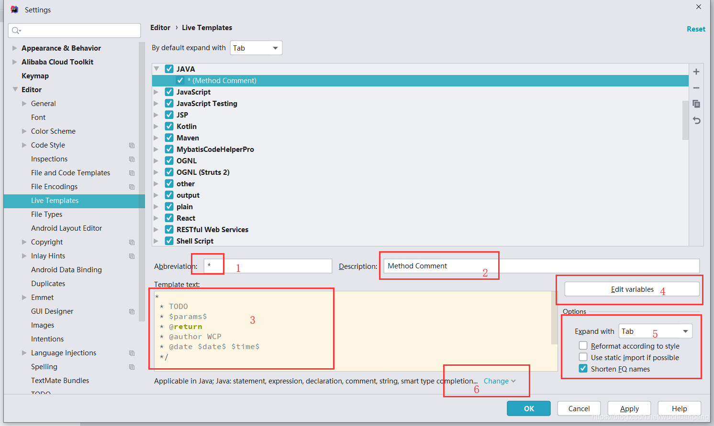

生成.ipr文件: mvn idea:project  
生成.iws文件: mvn idea:workspace  
生成.iml文件: mvn idea:module  

### 代码块
###方法注释
[参考链接](https://www.cnblogs.com/silentercn/p/9782230.html)  
Settings >> Editor >> Live TempLateS   
example:  
自定义表达式： 
groovyScript("def result=''; def params=\"${_1}\".replaceAll('[\\\\[|\\\\]|\\\\s]', '').split(',').toList(); for(i = 0; i < params.size(); i++) {if(params[i] == '') return result;if(i==0) result += '\\n'; result+=' * @param ' + params[i] + ((i < params.size() - 1) ? '\\n' : '')}; return result", methodParameters())  
groovyScript("return \"${_1}\" ", methodParameters())  

###plugins
1. lombok
2. free mybatis plugin (mybatis插件) 
3. MyBatis Log Plugin (控制台显示完整的可执行sql语句)
4. Restfultoolkit (url查找 及controller调试)
5. easy code 代码生成插件 [相关文档](https://gitee.com/makejava/EasyCode/wikis/pages)

### idea在service显示多个窗口
>.idea->workspace 下中找到 RunDashboard 替换成如下

    <component name="RunDashboard">
    <option name="configurationTypes">
      <set>
        <option value="SpringBootApplicationConfigurationType" />
      </set>
    </option>
    <option name="ruleStates">
      <list>
        <RuleState>
          <option name="name" value="ConfigurationTypeDashboardGroupingRule" />
        </RuleState>
        <RuleState>
          <option name="name" value="StatusDashboardGroupingRule" />
        </RuleState>
      </list>
    </option>
    </component>